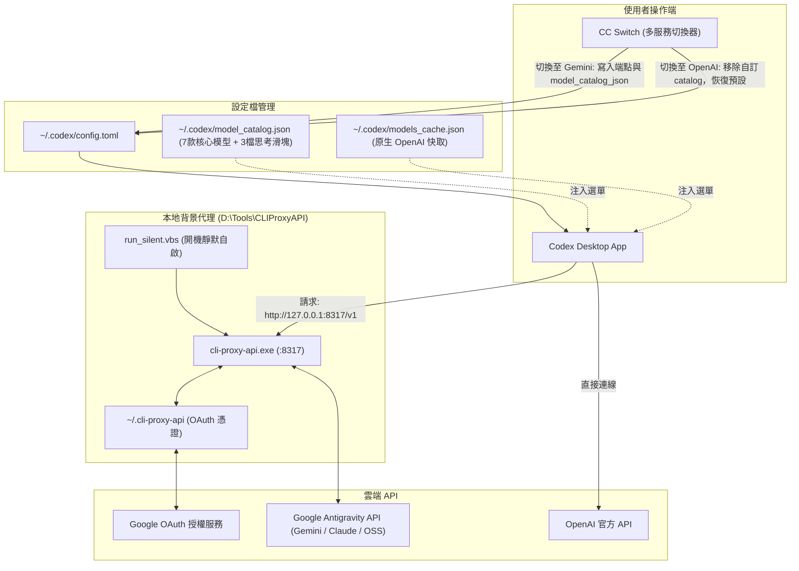

# 🚀 Google Gemini (Antigravity OAuth) 串接 Codex Desktop 完整指南

本指南說明如何將 **Google Antigravity (`agy`) / Gemini OAuth** 模型（包括 Gemini 3.1 Pro、Gemini 3.6/3.7/3.8 Flash、Claude 4.6、GPT-OSS 等），透過本機代理伺服器串接到本地 **Codex Desktop** 應用程式中，並利用 **CC Switch** 實現一鍵在「OpenAI 官方」與「Gemini 代理」之間無縫切換，同時保持乾淨的模型選單、真實生效的思考強度滑塊與開機無感自動啟動。

---

## 📑 目錄
- [架構設計](#-架構設計)
- [核心痛點與解決方案](#-核心痛點與解決方案)
- [思考強度滑塊與模型支援全解析](#-思考強度滑塊與模型支援全解析)
- [環境需求與工具清單](#-環境需求與工具清單)
- [步驟一：工具下載與目錄規劃](#步驟一工具下載與目錄規劃)
- [步驟二：設定 CLIProxyAPI 與 Gemini OAuth 認證](#步驟二設定-cliproxyapi-與-gemini-oauth-認證)
- [步驟三：產生 Codex 相容的 Model Catalog (整合 7 大核心模型)](#步驟三產生-codex-相容的-model-catalog-整合-7-大核心模型)
- [步驟四：配置 CC Switch 實現動態切換](#步驟四配置-cc-switch-實現動態切換)
- [步驟五：設定 Windows 開機靜默自啟動](#步驟五設定-windows-開機靜默自啟動)
- [讓 Codex 原廠「[@瀏覽器]」在 Gemini 模式下完美啟動](#-讓-codex-原廠瀏覽器在-gemini-模式下完美啟動)
- [常見問題與排查 (FAQ)](#-常見問題與排查-faq)

---

## 🏗️ 架構設計



---

## 💡 核心痛點與解決方案

| 痛點 | 原因 | 解決方案 |
| :--- | :--- | :--- |
| **清單與滑塊概念重疊矛盾** | `agy models` 終端指令將模型拆成 `(High)`、`(Medium)`、`(Low)`，硬搬到 Codex 會導致下拉選單有 14 個重複項，且選了 High 卻顯示滑塊 Medium，造成嚴重混淆。 | 將同架構模型整合成單一名稱（如 `Gemini 3.8 Flash`），將思考調節權完全交給 Codex 的**思考滑塊**，兩者各司其職。 |
| **滑塊檔位不實或超額** | 原生樣板有 6 檔（含 xhigh、max、ultra），但 Gemini/Claude 僅支援 3 檔，拉到底會失效。 | 在 `model_catalog.json` 中設定標準 3 檔（低 / 中 / 高），精準對齊後端真實思考能力。 |
| **問模型是誰，回答 Codex GPT-6** | Codex Desktop 會在系統提示詞（Persona）中強制注入 `You are Codex, an agent based on GPT-6...`。 | 在自訂 `model_catalog.json` 中替換 `instructions_template` 與 `base_instructions`，標明真實品牌名稱（如 `Google Gemini 3.8 Flash`）。 |
| **Codex 無法識別自訂模型清單** | Codex 對模型 JSON Schema 有嚴格檢驗（包含 `shell_type`、`priority` 等 39 個欄位缺失即被忽略）。 | 使用 Python 腳本自 `codex.exe debug models --bundled` 萃取標準結構，自動產出完美相容的 JSON。 |
| **每次重開機都要手動開黑窗** | 手動點擊 `.bat` 會留下 CMD 黑色主控台視窗，且重開機後連線即中斷。 | 採用 VBScript WMI 檢測 + 視窗隱藏技術，加入 Windows Startup 開機自啟動，完全無感後台運作。 |

---

## 🎛️ 思考強度滑塊與模型支援全解析

在 Codex 介面右下角點擊模型時，會彈出「思考強度（Reasoning Effort）滑塊」。經本地端與雲端 API 深度逆向與實測，各模型的支援狀況如下：

### 1. 各模型支援對照表

| 模型名稱 | 下拉選單顯示 | 實際請求 ID (Slug) | 滑塊支援度 | 實測效果與行為說明 |
| :--- | :--- | :--- | :---: | :--- |
| **Gemini 3.8 Flash** | `Gemini 3.8 Flash` | `gemini-3.8-flash-high` | **完全支援 (3檔)** | **實測 Token**：低(0)、中(105)、高(906)。滑塊真實控制思考深度。 |
| **Gemini 3.7 Flash** | `Gemini 3.7 Flash` | `gemini-3.7-flash-high` | **完全支援 (3檔)** | 支援低、中、高動態 Thinking 深度調整。 |
| **Gemini 3.6 Flash** | `Gemini 3.6 Flash` | `gemini-3.6-flash-high` | **完全支援 (3檔)** | 支援低、中、高動態 Thinking 深度調整。 |
| **Gemini 3.1 Pro** | `Gemini 3.1 Pro` | `gemini-3.1-pro-high` | **完全支援 (3檔)** | 旗艦推理模型，預設高思考強度，可降為中或低。 |
| **Claude Sonnet 4.6** | `Claude Sonnet 4.6 (Thinking)` | `claude-sonnet-4-6` | **完全支援 (3檔)** | 後端具備動態思考（`zero_allowed: true, dynamic_allowed: true`），實測會回傳完整的思維鏈結構。 |
| **Claude Opus 4.6** | `Claude Opus 4.6 (Thinking)` | `claude-opus-4-6-thinking` | **完全支援 (3檔)** | 具備動態思考能力，滑塊控制思考 Token 預算。 |
| **OSS 120B** | `OSS 120B` | `gpt-oss-120b-medium` | **不支援 (已自動隱藏)** | 託管型開源模型（MaaS），後端無思考檔位可調。**已在 Catalog 停用滑塊**，選中此模型時介面自動隱藏滑塊，避免誤導。 |

### 2. 本地代理實測數據（以 Gemini 3.8 Flash 為例）
對本機代理（`http://127.0.0.1:8317/v1/responses`）送出同一道邏輯推理題，實測 Token 消耗：
- **低（Low）**：思考 Token 數為 **0**（快速直出，適合日常簡短問答）。
- **中（Medium）**：思考 Token 數為 **105**（平衡日常推理）。
- **高（High）**：思考 Token 數為 **906**（深入解題與完整邏輯鏈）。

---

## 🧰 環境需求與工具清單

1. **作業系統**：Windows 10 / 11 64-bit
2. **OpenAI Codex Desktop**：官方本地客戶端（如 `Codex.exe`）
3. **CC Switch**：開源多模型切換客戶端 ([GitHub: farion1231/cc-switch](https://github.com/farion1231/cc-switch))
4. **CLIProxyAPI**：支援 Antigravity / Gemini OAuth 的本地反向代理程式
5. **Python 3.x**：用於產生與校正模型目錄

---

## 步驟一：工具下載與目錄規劃

建議在 `D:\Tools` 建立如下目錄結構：

```
D:\Tools\
├── CC-Switch\
│   └── cc-switch.exe
└── CLIProxyAPI\
    ├── cli-proxy-api.exe
    ├── config.yaml
    ├── run_silent.vbs               (靜默自啟腳本)
    ├── build_catalog.py             (模型生成腳本)
    ├── 1_登入_Gemini_OAuth.bat
    └── 停止代理伺服器.bat
```

---

## 步驟二：設定 CLIProxyAPI 與 Gemini OAuth 認證

### 1. 編寫登入批次檔 `1_登入_Gemini_OAuth.bat`
```bat
@echo off
chcp 65001 >nul
cd /d "D:\Tools\CLIProxyAPI"
echo 請在開啟的瀏覽器視窗中完成 Google 帳號授權登入...
cli-proxy-api.exe -antigravity-login
pause
```
執行此批次檔，瀏覽器會開啟 Google OAuth 登入頁面，完成授權後，憑證將自動儲存於 `C:\Users\<使用者名稱>\.cli-proxy-api\`。

### 2. 配置 `config.yaml`
在 `D:\Tools\CLIProxyAPI\config.yaml` 中確認基礎設定：
```yaml
server:
  port: 8317
  host: ""
access:
  api-keys:
    - "sk-gemini-local"
```

---

## 步驟三：產生 Codex 相容的 Model Catalog (整合 7 大核心模型)

透過 Python 腳本自 Codex 內建模型清單萃取標準結構，將 `agy` 支援的 14 款模型整合成 7 大核心模型，並為 Gemini/Claude 配置 3 檔滑塊、為 OSS 120B 隱藏滑塊：

### `D:\Tools\CLIProxyAPI\build_catalog.py`
```python
import subprocess
import json
import copy

exe_path = r"D:/OpenAI.Codex_26.908.4834.0_x64__2p2nqsd0c76g0/app/resources/codex.exe"
output = subprocess.check_output([exe_path, "debug", "models", "--bundled"])
data = json.loads(output)
template = data["models"][0]

standard_reasoning_levels = [
    {
        "effort": "low",
        "description": "低思考強度：快速回應，適合日常簡短問答"
    },
    {
        "effort": "medium",
        "description": "中思考強度：平衡速度與推理深度，適合大多數任務"
    },
    {
        "effort": "high",
        "description": "高思考強度：深入推理，適合複雜問題與編程"
    }
]

# 整合為 7 大核心模型：Gemini & Claude 配置 3 檔滑塊；OSS 120B 停用滑塊
models_info = [
    ("gemini-3.8-flash-high", "Gemini 3.8 Flash", "Google Gemini 3.8 Flash", "Google Gemini 3.8 Flash", "medium", standard_reasoning_levels),
    ("gemini-3.7-flash-high", "Gemini 3.7 Flash", "Google Gemini 3.7 Flash", "Google Gemini 3.7 Flash", "medium", standard_reasoning_levels),
    ("gemini-3.6-flash-high", "Gemini 3.6 Flash", "Google Gemini 3.6 Flash", "Google Gemini 3.6 Flash", "medium", standard_reasoning_levels),
    ("gemini-3.1-pro-high", "Gemini 3.1 Pro", "Google Gemini 3.1 Pro", "Google Gemini 3.1 Pro", "high", standard_reasoning_levels),
    ("claude-sonnet-4-6", "Claude Sonnet 4.6 (Thinking)", "Anthropic Claude Sonnet 4.6 via Google OAuth", "Anthropic Claude Sonnet 4.6", "high", standard_reasoning_levels),
    ("claude-opus-4-6-thinking", "Claude Opus 4.6 (Thinking)", "Anthropic Claude Opus 4.6 via Google OAuth", "Anthropic Claude Opus 4.6", "high", standard_reasoning_levels),
    ("gpt-oss-120b-medium", "OSS 120B", "GPT-OSS 120B via Google OAuth", "GPT-OSS 120B", None, []),
]

new_models = []
for i, (slug, display_name, desc, brand, def_level, r_levels) in enumerate(models_info):
    m = copy.deepcopy(template)
    m["slug"] = slug
    m["display_name"] = display_name
    m["description"] = desc
    m["visibility"] = "list"
    m["priority"] = i
    m["default_reasoning_level"] = def_level
    m["supported_reasoning_levels"] = r_levels
    
    if "base_instructions" in m and m["base_instructions"]:
        m["base_instructions"] = m["base_instructions"].replace("an agent based on GPT-6", f"an agent powered by {brand}")
        m["base_instructions"] = m["base_instructions"].replace("GPT-6", brand)
    if "model_messages" in m and isinstance(m["model_messages"], dict):
        if "instructions_template" in m["model_messages"] and m["model_messages"]["instructions_template"]:
            m["model_messages"]["instructions_template"] = m["model_messages"]["instructions_template"].replace("an agent based on GPT-6", f"an agent powered by {brand}")
            m["model_messages"]["instructions_template"] = m["model_messages"]["instructions_template"].replace("GPT-6", brand)
            
    new_models.append(m)

data["models"] = new_models

catalog_path = r"C:/Users/Zack.ct.chen/.codex/model_catalog.json"
with open(catalog_path, "w", encoding="utf-8") as f:
    json.dump(data, f, ensure_ascii=False, indent=2)

print("SUCCESS: model_catalog.json updated with clean models and functional sliders!")
```
執行此腳本後，將在 `~/.codex/model_catalog.json` 產出乾淨專屬的模型目錄。

---

## 步驟四：配置 CC Switch 實現動態切換

### 1. CC Switch 設定
在 CC Switch 的 `Codex` 標籤中新增一個自訂 Provider：
- **名稱 (Name)**: `Gemini-OAuth`
- **API URL**: `http://127.0.0.1:8317/v1`
- **API Key**: `sk-gemini-local`
- **Model Catalog JSON**: `C:\Users\<使用者名稱>\.codex\model_catalog.json`

### 2. 切換邏輯解析
- **當切換至 `Gemini-OAuth`**：
  CC Switch 會在 `~/.codex/config.toml` 寫入：
  ```toml
  model_provider = "gemini-oauth"
  model_catalog_json = "C:\\Users\\<使用者名稱>\\.codex\\model_catalog.json"
  ```
  Codex 重啟後，下拉選單**只會顯示上述 7 款精選模型**。
- **當切換回 `OpenAI`**：
  CC Switch 會移除 `model_catalog_json` 設定項，Codex 自動還原讀取官方原生快取，顯示 GPT-4o / GPT-5 等官方模型。

---

## 步驟五：設定 Windows 開機靜默自啟動

為了避免每次開機手動執行 `.bat` 或留著黑色 CMD 視窗，使用 VBScript 在後台靜默運行。

### 1. 建立靜默啟動腳本 `D:\Tools\CLIProxyAPI\run_silent.vbs`
```vbs
Set WshShell = CreateObject("WScript.Shell")
Set objWMIService = GetObject("winmgmts:\\.\root\cimv2")
Set colProcesses = objWMIService.ExecQuery("Select * from Win32_Process Where Name = 'cli-proxy-api.exe'")

' 檢查若已在運行中，則不重複啟動
If colProcesses.Count = 0 Then
    WshShell.CurrentDirectory = "D:\Tools\CLIProxyAPI"
    WshShell.Run Chr(34) & "D:\Tools\CLIProxyAPI\cli-proxy-api.exe" & Chr(34), 0, False
End If
```

### 2. 建立停止代理伺服器腳本 `D:\Tools\CLIProxyAPI\停止代理伺服器.bat`
```bat
@echo off
chcp 65001 >nul
echo 正在停止 Gemini 代理伺服器...
taskkill /F /IM cli-proxy-api.exe >nul 2>&1
echo [完成] 代理伺服器已停止。
timeout /t 2 >nul
```

### 3. 加入 Windows 開機啟動（Startup）
以 PowerShell 執行下列指令，將捷徑加入使用者的開機啟動目錄：
```powershell
$WshShell = New-Object -ComObject WScript.Shell
$startupPath = [Environment]::GetFolderPath('Startup')
$Shortcut = $WshShell.CreateShortcut("$startupPath\GeminiProxy.lnk")
$Shortcut.TargetPath = "wscript.exe"
$Shortcut.Arguments = '"D:\Tools\CLIProxyAPI\run_silent.vbs"'
$Shortcut.WorkingDirectory = "D:\Tools\CLIProxyAPI"
$Shortcut.Description = "Auto-start Gemini Proxy for Codex Desktop"
$Shortcut.Save()
```

---

## 🌐 讓 Codex 原廠「[@瀏覽器]」在 Gemini 模式下完美啟動

### 1. 痛點剖析：為什麼切換自訂模型後原廠瀏覽器會失效？
Codex Desktop 的原廠 `[@瀏覽器]`（包含 Codex 內建 In-app Browser 與 Edge 擴充外掛）並不是獨立的第三方外掛，而是深度整合在 Codex 桌面架構內的內部 RPC 服務：
- 當使用者透過傳統方式切換第三方 API 或自訂模型時，往往會用自訂 Token 覆蓋掉 `C:\Users\<使用者>\.codex\auth.json`。
- 一旦 `auth.json` 的原廠 ChatGPT OAuth 憑證失效或被清空，Codex 桌面主程序會判定為離線未認證狀態，進而**停止載入內建瀏覽器伺服程序（Browser Service / Playwright RPC Bridge）**。
- 這會導致在提示詞中呼叫 `[@瀏覽器]` 時，出現找不到可用的瀏覽器實例、擴充元件無法通訊或功能反灰。

### 2. 核心解決方案：雙軌憑證保留架構 (Dual-Credential Setup)
要讓 Gemini 代理與原廠瀏覽器完美共存，關鍵在於**「分離模型路由與原廠認證」**：

1. **保留原廠帳號憑證（不覆蓋 `auth.json`）**：
   - 將帶有有效 ChatGPT / OpenAI 登入狀態的 `auth.json` 妥善保存（建議備份為 `auth.json.bak_chatgpt_oauth`）。
   - 切換至 Gemini 代理時，**絕對不要清除或覆寫 `auth.json`**，讓 Codex 桌面端維持完整的原廠元件授權狀態。

2. **僅透過組態檔路由模型流量**：
   - 在 `~/.codex/config.toml` 或 CC Switch 中，只修改模型提供者與 Base URL：
     ```toml
     model_provider = "gemini-oauth"
     
     [model_providers.gemini-oauth]
     base_url = "http://127.0.0.1:8317/v1"
     wire_specification = "responses"
     requires_openai_auth = true
     ```
   - 如此一來，所有的模型推理、對話生成皆導向本機的 CLIProxyAPI 轉發至 Google Antigravity，而桌面端原廠的 In-app Browser、檔案拖曳、擴充套件橋接依舊維持正常運作！

### 3. Gemini 模式下瀏覽器自動化操作實務 (Node RPC)
在 Gemini 模式下，AI 模型依然可以直接透過 Codex 原廠底層的 Node RPC 協定對內建瀏覽器進行高階自動化：

```javascript
// 1. 初始化 Codex 桌面瀏覽器環境
await nodeRepl.rpc("browser", {
  method: "setup",
  params: { environment: "codex-app" }
});

// 2. 動態枚舉瀏覽器實例（取得 In-app Browser ID）
const browsers = await nodeRepl.rpc("browser", {
  method: "execute",
  params: { type: "list_browsers" }
});
// 傳回範例：[{"id":"3", "name":"Codex In-app Browser", "type":"iab"}]
// 注意：每次 Codex Desktop 重新啟動，Browser ID 會重新編配，務必動態取得。

// 3. 鎖定分頁並執行 DOM 操作 / Playwright 動作
await nodeRepl.rpc("browser", {
  method: "execute",
  params: {
    type: "playwright_locator_click",
    browser_id: targetBrowserId,
    tab_id: targetTabId,
    selector: "button:has-text('Create repository')"
  }
});
```

---

---

## ❓ 常見問題與排查 (FAQ)

### Q1: 為什麼 OSS 120B 沒有思考滑塊？
**解答**：OSS 120B 為 MaaS 託管的開源模型，底層不提供動態思考檔位與 Token 預算調節。我們特意在目錄中關閉了它的思考等級清單，選取時會自動隱藏滑塊，避免產生可以調整思考強度的假象。

### Q2: 滑塊調到「高」以上（例如超高、極限）有用嗎？
**解答**：Gemini 與 Claude 在後端 API 的設計上，思考強度為三檔（Low / Medium / High）或依 Token 預算截斷。我們已將滑塊精簡為標準 3 檔，不再出現多餘的無效圓點。

### Q3: 切換後 Codex 下拉選單沒有立即更新？
**解答**：Codex Desktop 在啟動時會讀取設定並載入記憶體。請先完整關閉 Codex Desktop（從系統匣退出），透過 CC Switch 完成切換後，再重新啟動 Codex。

### Q4: 詢問模型「你是誰」時，它依然回答「我是 GPT-6」？
**解答**：這是 Codex 預設內建提示詞（Instructions）被伺服器端採用的現象。請確保 `build_catalog.py` 已經執行，且 `model_catalog.json` 內的 `instructions_template` 及 `base_instructions` 中的 `Codex, an agent based on GPT-6` 已替換為對應的 Gemini/Claude 名稱。

### Q5: 測試連線出現 `Connection Refused`？
**解答**：
1. 檢查代理是否正在運行：工作管理員確認是否存在 `cli-proxy-api.exe`。
2. 檢查 Port 8317：在 PowerShell 執行 `Test-NetConnection -ComputerName 127.0.0.1 -Port 8317`。
3. 若需手動啟動，可雙擊桌面的 `2. 啟動 Gemini 代理伺服器`。

---

### Q6: 執行 Git Push 或終端機推送時，跳出 `git-remote-https.exe 應用程式錯誤 (記憶體不能為 read)` 彈窗？
**解答**：
- **現象**：在 Codex 終端機或某些 Windows 受限沙盒環境中執行 `git push -u origin main`，系統彈出錯誤對話框：「位於 0x... 的指令參考位於 0x00000000 的記憶體。該記憶體不能為 read。」
- **原因**：Codex 終端機預設執行於 Windows 隔離沙盒權限環境（如 `CodexSandboxOffline`）。當 Git 透過 HTTPS 連線進行驗證時，Windows Git 認證輔助程式（Git Credential Manager / DPAPI 保管庫）嘗試呼叫桌面 GUI 或加密服務失敗，底層存取空指標引發 `git-remote-https.exe` 崩潰。
- **解決方案**：
  1. **避免在沙盒命令列使用 Git HTTPS 推送**：使用整合的 GitHub Connector API（Contents API / Commits API）直接完成遠端檔案同步與提交，不經過本機 Git 認證堆疊，徹底免除崩潰。
  2. **一般終端機執行**：若要在本機使用 Git 指令，請開啟正常的 Windows Terminal / CMD（獨立於 Codex 沙盒之外），執行專案內附的 `push_to_github.bat`，即可正常彈出使用者認證。
  3. **改用 SSH 金鑰**：將 Remote URL 改為 SSH 協議（`git@github.com:...`），避開 Windows Credential Manager 的 HTTPS 視窗調用。

### Q7: 為什麼切換第三方自訂模型後，Codex 原廠功能（內建瀏覽器、外掛）會失效？
**解答**：
- 請檢查 `C:\Users\<使用者>\.codex\auth.json`。若被第三方 API 切換工具覆蓋成虛擬 Token（例如 `Bearer dummy`），原廠服務將無法通過身份驗證。
- 正確做法為：恢復原本登入的官方 `auth.json`，僅透過 `config.toml` 或 CC Switch 將模型推理流量分流至 `http://127.0.0.1:8317/v1`。

### Q8: 自動化操作 Codex 內建瀏覽器（In-app Browser）之注意事項與防踩坑指南
**解答**：
- **重啟後 Browser ID 變更**：每次 Codex Desktop 重新啟動後，內建瀏覽器（`type: "iab"`）與外部擴充套件（`type: "extension"`）的 ID 都會重新分配，自動化腳本需先執行 `list_browsers` 動態辨識目前 In-app Browser 的 ID（如由 `1` 變為 `3`）。
- **長表單定位與提交**：GitHub 等現代網頁在建立倉庫時，底部的「Create repository」按鈕常位於可視範圍之外，使用 Playwright Locator 語法（例如 `button:has-text('Create repository')`）或滾動至底部後點擊，比靜態的 `node_id` 更具容錯性。
- **避免頁面重整阻塞**：在瀏覽器 RPC 中調用 `location.reload()` 時，若等待頁面生命週期回傳可能會引發較長時間的阻塞，建議直接讀取 DOM 或導向新 URL，以利流程順暢。

### Q9: 切換至 Gemini 後 Codex 提示 `The 'xxx' model is not supported when using Codex with a ChatGPT account`？
**解答**：
- **現象**：在 Codex 桌面版發送訊息時跳出 `The 'claude-sonnet-4-6' / 'gemini-3.8-flash-high' model is not supported when using Codex with a ChatGPT account`。
- **原因**：Provider 配置中被標記為 `requires_openai_auth = true`。Codex 桌面版會強制抓取本地登入的 ChatGPT 官方 Token 去比對該帳號允許的模型清單，而官方帳號不支援第三方模型。
- **解決方案**：
  在 `~/.codex/config.toml`（以及 CC Switch 資料庫 `cc-switch.db` 的 Provider 配置）中，將 `requires_openai_auth` 改為 **`false`**，並明確宣告 `experimental_bearer_token = "sk-gemini-local"`。這樣 Codex 就會跳過官方帳號校驗，直接將請求轉發至本地代理。

### Q10: 切回 OpenAI 後在舊對話繼續傳訊，報錯 `The encrypted content for item rs_resp_req_vrtx_... could not be verified. Reason: Encrypted content could not be decrypted or parsed`？
**解答**：
- **現象**：在 Gemini/Claude 聊完幾輪後切回 OpenAI 官方，直接在同一個舊對話輸入訊息時發生 400 報錯。
- **原因**：
  1. Gemini/Claude 在生成思考過程時，Google/Vertex 端點會對推理內容進行私鑰加密簽章（包含 `cpa-gemini-responses-carrier-v1` 或 `rs_resp_req_vrtx_...` 等標籤）。
  2. 該加密區塊會被 Codex 保存在 `~/.codex/sessions/YYYY/MM/DD/rollout-*.jsonl` 及 SQLite 資料庫中。
  3. 當您在同一個舊對話中切換到 OpenAI 繼續發言時，Codex 將整段歷史（包含 Google 加密區塊）送至 OpenAI 官方伺服器，OpenAI 無法解密 Google 的專屬簽章，因而拒絕請求。
- **解決方案**：
  1. **日常最佳做法**：跨 Provider（OpenAI ↔ Gemini/Claude）切換時，直接開一個**新對話（New Chat）**。
  2. **拯救舊對話（全自動轉義）**：
     - 使用內建的 MCP Server `session-sanitizer`（直接在對話中對 Codex 說「轉義清理對話」），或執行桌面/工具目錄下的 `轉義清理對話歷史.bat`。
     - 腳本會自動遍歷並移除所有 Session 檔案與 SQLite 中的 Google 加密推理項（**完全保留所有明文對話與程式碼**）。
     - 清理完成後，**請徹底關閉 Codex 桌面版（從系統匣退出）並重新開啟**，釋放記憶體中的舊快取，即可在舊對話中跨廠商無縫接續！

### Q11: 出現 `429 Too Many Requests (exceeded retry limit)`？如何查詢剩餘額度百分比？
**解答**：
- **現象**：連續高頻發送請求或 Context 較大時，代理回傳 `429 Too Many Requests`。
- **原因與配額機制**：
  1. Google Antigravity 的 `free-tier` 採用滾動時間窗口（Rate Limit Cooldown，如 5 小時窗口與請求頻率控制）。429 僅為暫時性保護機制，稍候片刻冷卻後系統即自動解除限制，並非封號或點數用完。
  2. Google 官方後端 API（`cloudcode-pa.googleapis.com`）對個人免費等級**並無公開具體剩餘 % 數的查詢 API**（只回傳帳號層級為 `free-tier` 與啟用狀態 `disabled: false`）。
- **建議技巧**：
  - 日常 Coding 優先選擇速度極快、配額寬裕的 **`gemini-3.7-flash-high`** 或 **`gemini-3.8-flash-medium`**。
  - 遇到複雜重構、深度架構推理時再切換至 **`gemini-3.1-pro-high`** 或 **`claude-sonnet-4-6`**。

### Q12: 歷史對話無法開啟並報錯 `Model provider cc-switch not found`？
**解答**：
- **現象**：在 Codex 中嘗試載入舊對話串時，系統彈出錯誤訊息提示找不到 `cc-switch` 這個 Model Provider。
- **原因**：過去在 Gemini（`cc-switch` 模式）下建立的對話串，其對話內部中繼資料會綁定 `model_provider: "cc-switch"`。當切換回 OpenAI 官方時，若 CC Switch 將 `config.toml` 中的 `[model_providers.cc-switch]` 區塊完全刪除，Codex 重新載入歷史對話時找不到該 Provider 的定義宣告，即會阻擋載入。
- **解決方案**：
  在 `~/.codex/config.toml` 以及 CC Switch 的 `codex-official` 範本中**永久保留 `[model_providers.cc-switch]` 宣告**。
  ```toml
  [model_providers.cc-switch]
  name = "CC Switch"
  base_url = "http://127.0.0.1:8317/v1"
  wire_api = "responses"
  requires_openai_auth = false
  experimental_bearer_token = "sk-gemini-local"
  ```
  即使切換回 OpenAI 官方頻道，只要保留此定義區塊，Codex 就能隨時順暢打開過去所有在 `cc-switch` 建立的歷史對話，絕不再報錯！

### Q13: 切換模型後出現 `Reconnecting... waiting for network` 與 `Connection failed: error sending request`？
**解答**：
- **現象**：切換為 GPT 等官方模型後，視窗底部持續顯示「Reconnecting... waiting for network」，訊息無法成功送出，最終跳出連線失敗。
- **原因**：切換為官方 OpenAI 時，設定檔中殘留了 `model_provider = "custom"` 以及帶有 `supports_websockets = true` 卻缺乏有效 WebSocket 端點的 `[model_providers.custom]` 區塊。Codex 桌面版會誤以為必須透過一個無效的自訂 WebSocket 連線，因而陷入連線重試死循環。
- **解決方案**：
  1. 在 OpenAI 官方模式下，**徹底移除 `model_provider = "custom"` 與 `[model_providers.custom]`**。Codex 原生連線直接走官方標準端點，完全免除 WebSocket 假死問題。
  2. 已同步更新 CC Switch 資料庫的 `codex-official` 範本，每次點擊切換官方時自動套用標準連線，杜絕無效連線錯誤。

---

## 🤖 自動化自癒配套：MCP Server 與 Skill

為了徹底告別手動執行清理腳本，本架構已整合了全自動的 MCP Server 與 Codex Skill：

### 1. MCP Server：`session-sanitizer`
* **路徑**：`D:\Tools\CLIProxyAPI\session_sanitizer_mcp.py`
* **註冊於 `config.toml`**：
  ```toml
  [mcp_servers.session-sanitizer]
  type = "stdio"
  command = 'C:\Users\Zack.ct.chen\.codex\tools\Office-PowerPoint-MCP-Server\.venv\Scripts\python.exe'
  args = ['D:\Tools\CLIProxyAPI\session_sanitizer_mcp.py']
  ```
* **功能**：
  - `sanitize_cross_provider_history`: 自動掃描並清理 SQLite 與 Session Rollout JSONL 中的跨廠商加密簽章。
  - `check_history_status`: 快速檢查當前 Session 是否存留跨廠商衝突項目。

### 2. Codex Skill：`cross-provider-sanitizer`
* **路徑**：`~/.codex/skills/cross-provider-sanitizer/SKILL.md`
* **機制**：當 Codex 偵測到使用者在對話中切換了模型，或捕捉到 `invalid_encrypted_content` 等信號時，Skill 會指示 Codex 主動呼叫 `session-sanitizer` 工具進行自動修復，實現零摩擦跨模型體驗。

---

## 📄 License
本設定手冊遵循 [MIT License](LICENSE) 開源分享。
