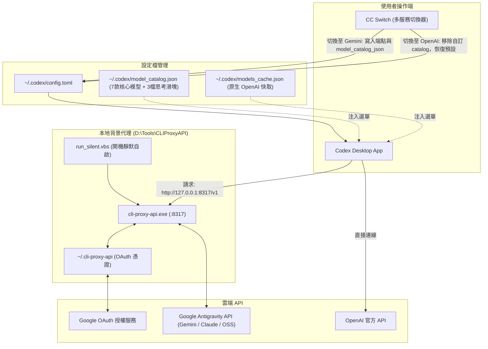

# 🚀 Google Gemini (Antigravity OAuth) 串接 Codex Desktop 完整指南

本指南說明如何將 **Google Antigravity (`agy`) / Gemini OAuth** 模型（包括 Gemini 3.1 Pro、Gemini 3.6/3.7/3.8 Flash、Claude 4.6、GPT-OSS 等），透過本機代理伺服器串接到本地 **Codex Desktop** 應用程式中，並利用 **CC Switch** 實現一鍵在「OpenAI 官方」與「Gemini 代理」之間無縫切換，同時保持乾淨的模型選單、真實生效的思考強度滑塊與開機無感自動啟動。

---

## 📑 目錄
- [架構設計](#-架構設計)
- [核心痛點與解決方案](#-核心痛點與解決方案)
- [思考強度滑塊與模型支援全解析](#-思考強度滑塊與模型支援全解析)
- [環境需求與工具清單](#-環境需求與工具清單)
- [步驟一：工具下載與目錄規劃](#步驟一工具下載與目錄規劃)
- [步驟二：設定 CLIProxyAPI 與 Gemini OAuth 認證](#步驟二設定-cliproxyapi-與-gemini-oauth-認證)
- [步驟三：產生 Codex 相容的 Model Catalog (整合 7 大核心模型)](#步驟三產生-codex-相容的-model-catalog-整合-7-大核心模型)
- [步驟四：配置 CC Switch 實現動態切換](#步驟四配置-cc-switch-實現動態切換)
- [步驟五：設定 Windows 開機靜默自啟動](#步驟五設定-windows-開機靜默自啟動)
- [讓 Codex 原廠「[@瀏覽器]」在 Gemini 模式下完美啟動](#-讓-codex-原廠瀏覽器在-gemini-模式下完美啟動)
- [訂閱額度查詢（check-quota）](#訂閱額度查詢check-quota)
- [常見問題與排查 (FAQ)](#-常見問題與排查-faq)

---

## 🏗️ 架構設計



---

## 💡 核心痛點與解決方案

| 痛點 | 原因 | 解決方案 |
| :--- | :--- | :--- |
| **清單與滑塊概念重疊矛盾** | `agy models` 終端指令將模型拆成 `(High)`、`(Medium)`、`(Low)`，硬搬到 Codex 會導致下拉選單有 14 個重複項，且選了 High 卻顯示滑塊 Medium，造成嚴重混淆。 | 將同架構模型整合成單一名稱（如 `Gemini 3.8 Flash`），將思考調節權完全交給 Codex 的**思考滑塊**，兩者各司其職。 |
| **滑塊檔位不實或超額** | 原生樣板有 6 檔（含 xhigh、max、ultra），但 Gemini/Claude 僅支援 3 檔，拉到底會失效。 | 在 `model_catalog.json` 中設定標準 3 檔（低 / 中 / 高），精準對齊後端真實思考能力。 |
| **問模型是誰，回答 Codex GPT-6** | Codex Desktop 會在系統提示詞（Persona）中強制注入 `You are Codex, an agent based on GPT-6...`。 | 在自訂 `model_catalog.json` 中替換 `instructions_template` 與 `base_instructions`，標明真實品牌名稱（如 `Google Gemini 3.8 Flash`）。 |
| **Codex 無法識別自訂模型清單** | Codex 對模型 JSON Schema 有嚴格檢驗（包含 `shell_type`、`priority` 等 39 個欄位缺失即被忽略）。 | 使用 Python 腳本自 `codex.exe debug models --bundled` 萃取標準結構，自動產出完美相容的 JSON。 |
| **每次重開機都要手動開黑窗** | 手動點擊 `.bat` 會留下 CMD 黑色主控台視窗，且重開機後連線即中斷。 | 採用 VBScript WMI 檢測 + 視窗隱藏技術，加入 Windows Startup 開機自啟動，完全無感後台運作。 |

---

## 🎛️ 思考強度滑塊與模型支援全解析

在 Codex 介面右下角點擊模型時，會彈出「思考強度（Reasoning Effort）滑塊」。經本地端與雲端 API 深度逆向與實測，各模型的支援狀況如下：

### 1. 各模型支援對照表

| 模型名稱 | 下拉選單顯示 | 實際請求 ID (Slug) | 滑塊支援度 | 實測效果與行為說明 |
| :--- | :--- | :--- | :---: | :--- |
| **Gemini 3.8 Flash** | `Gemini 3.8 Flash` | `gemini-3.8-flash-high` | **完全支援 (3檔)** | **實測 Token**：低(0)、中(105)、高(906)。滑塊真實控制思考深度。 |
| **Gemini 3.7 Flash** | `Gemini 3.7 Flash` | `gemini-3.7-flash-high` | **完全支援 (3檔)** | 支援低、中、高動態 Thinking 深度調整。 |
| **Gemini 3.6 Flash** | `Gemini 3.6 Flash` | `gemini-3.6-flash-high` | **完全支援 (3檔)** | 支援低、中、高動態 Thinking 深度調整。 |
| **Gemini 3.1 Pro** | `Gemini 3.1 Pro` | `gemini-3.1-pro-high` | **完全支援 (3檔)** | 旗艦推理模型，預設高思考強度，可降為中或低。 |
| **Claude Sonnet 4.6** | `Claude Sonnet 4.6 (Thinking)` | `claude-sonnet-4-6` | **完全支援 (3檔)** | 後端具備動態思考（`zero_allowed: true, dynamic_allowed: true`），實測會回傳完整的思維鏈結構。 |
| **Claude Opus 4.6** | `Claude Opus 4.6 (Thinking)` | `claude-opus-4-6-thinking` | **完全支援 (3檔)** | 具備動態思考能力，滑塊控制思考 Token 預算。 |
| **OSS 120B** | `OSS 120B` | `gpt-oss-120b-medium` | **不支援 (已自動隱藏)** | 託管型開源模型（MaaS），後端無思考檔位可調。**已在 Catalog 停用滑塊**，選中此模型時介面自動隱藏滑塊，避免誤導。 |

### 2. 本地代理實測數據（以 Gemini 3.8 Flash 為例）
對本機代理（`http://127.0.0.1:8317/v1/responses`）送出同一道邏輯推理題，實測 Token 消耗：
- **低（Low）**：思考 Token 數為 **0**（快速直出，適合日常簡短問答）。
- **中（Medium）**：思考 Token 數為 **105**（平衡日常推理）。
- **高（High）**：思考 Token 數為 **906**（深入解題與完整邏輯鏈）。

---

## 🧰 環境需求與工具清單

1. **作業系統**：Windows 10 / 11 64-bit
2. **OpenAI Codex Desktop**：官方本地客戶端（如 `Codex.exe`）
3. **CC Switch**：開源多模型切換客戶端 ([GitHub: farion1231/cc-switch](https://github.com/farion1231/cc-switch))
4. **CLIProxyAPI**：支援 Antigravity / Gemini OAuth 的本地反向代理程式
5. **Python 3.x**：用於產生與校正模型目錄

---

## 步驟一：工具下載與目錄規劃

建議在 `D:\Tools` 建立如下目錄結構：

```
D:\Tools\
├── CC-Switch\
│   └── cc-switch.exe
└── CLIProxyAPI\
    ├── cli-proxy-api.exe
    ├── config.yaml
    ├── run_silent.vbs               (靜默自啟腳本)
    ├── build_catalog.py             (模型生成腳本)
    ├── 1_登入_Gemini_OAuth.bat
    └── 停止代理伺服器.bat
```

---

## 步驟二：設定 CLIProxyAPI 與 Gemini OAuth 認證

### 1. 編寫登入批次檔 `1_登入_Gemini_OAuth.bat`
```bat
@echo off
chcp 65001 >nul
cd /d "D:\Tools\CLIProxyAPI"
echo 請在開啟的瀏覽器視窗中完成 Google 帳號授權登入...
cli-proxy-api.exe -antigravity-login
pause
```
執行此批次檔，瀏覽器會開啟 Google OAuth 登入頁面，完成授權後，憑證將自動儲存於 `C:\Users\<使用者名稱>\.cli-proxy-api\`。

### 2. 配置 `config.yaml`
在 `D:\Tools\CLIProxyAPI\config.yaml` 中確認基礎設定：
```yaml
server:
  port: 8317
  host: ""
access:
  api-keys:
    - "sk-gemini-local"
```

---

## 步驟三：產生 Codex 相容的 Model Catalog (整合 7 大核心模型)

透過 Python 腳本自 Codex 內建模型清單萃取標準結構，將 `agy` 支援的 14 款模型整合成 7 大核心模型，並為 Gemini/Claude 配置 3 檔滑塊、為 OSS 120B 隱藏滑塊：

### `D:\Tools\CLIProxyAPI\build_catalog.py`
```python
import subprocess
import json
import copy

exe_path = r"D:/OpenAI.Codex_26.908.4834.0_x64__2p2nqsd0c76g0/app/resources/codex.exe"
output = subprocess.check_output([exe_path, "debug", "models", "--bundled"])
data = json.loads(output)
template = data["models"][0]

standard_reasoning_levels = [
    {
        "effort": "low",
        "description": "低思考強度：快速回應，適合日常簡短問答"
    },
    {
        "effort": "medium",
        "description": "中思考強度：平衡速度與推理深度，適合大多數任務"
    },
    {
        "effort": "high",
        "description": "高思考強度：深入推理，適合複雜問題與編程"
    }
]

# 整合為 7 大核心模型：Gemini & Claude 配置 3 檔滑塊；OSS 120B 停用滑塊
models_info = [
    ("gemini-3.8-flash-high", "Gemini 3.8 Flash", "Google Gemini 3.8 Flash", "Google Gemini 3.8 Flash", "medium", standard_reasoning_levels),
    ("gemini-3.7-flash-high", "Gemini 3.7 Flash", "Google Gemini 3.7 Flash", "Google Gemini 3.7 Flash", "medium", standard_reasoning_levels),
    ("gemini-3.6-flash-high", "Gemini 3.6 Flash", "Google Gemini 3.6 Flash", "Google Gemini 3.6 Flash", "medium", standard_reasoning_levels),
    ("gemini-3.1-pro-high", "Gemini 3.1 Pro", "Google Gemini 3.1 Pro", "Google Gemini 3.1 Pro", "high", standard_reasoning_levels),
    ("claude-sonnet-4-6", "Claude Sonnet 4.6 (Thinking)", "Anthropic Claude Sonnet 4.6 via Google OAuth", "Anthropic Claude Sonnet 4.6", "high", standard_reasoning_levels),
    ("claude-opus-4-6-thinking", "Claude Opus 4.6 (Thinking)", "Anthropic Claude Opus 4.6 via Google OAuth", "Anthropic Claude Opus 4.6", "high", standard_reasoning_levels),
    ("gpt-oss-120b-medium", "OSS 120B", "GPT-OSS 120B via Google OAuth", "GPT-OSS 120B", None, []),
]

new_models = []
for i, (slug, display_name, desc, brand, def_level, r_levels) in enumerate(models_info):
    m = copy.deepcopy(template)
    m["slug"] = slug
    m["display_name"] = display_name
    m["description"] = desc
    m["visibility"] = "list"
    m["priority"] = i
    m["default_reasoning_level"] = def_level
    m["supported_reasoning_levels"] = r_levels
    
    if "base_instructions" in m and m["base_instructions"]:
        m["base_instructions"] = m["base_instructions"].replace("an agent based on GPT-6", f"an agent powered by {brand}")
        m["base_instructions"] = m["base_instructions"].replace("GPT-6", brand)
    if "model_messages" in m and isinstance(m["model_messages"], dict):
        if "instructions_template" in m["model_messages"] and m["model_messages"]["instructions_template"]:
            m["model_messages"]["instructions_template"] = m["model_messages"]["instructions_template"].replace("an agent based on GPT-6", f"an agent powered by {brand}")
            m["model_messages"]["instructions_template"] = m["model_messages"]["instructions_template"].replace("GPT-6", brand)
            
    new_models.append(m)

data["models"] = new_models

catalog_path = r"C:/Users/Zack.ct.chen/.codex/model_catalog.json"
with open(catalog_path, "w", encoding="utf-8") as f:
    json.dump(data, f, ensure_ascii=False, indent=2)

print("SUCCESS: model_catalog.json updated with clean models and functional sliders!")
```
執行此腳本後，將在 `~/.codex/model_catalog.json` 產出乾淨專屬的模型目錄。

---

## 步驟四：配置 CC Switch 實現動態切換

### 1. CC Switch 設定
在 CC Switch 的 `Codex` 標籤中新增一個自訂 Provider：
- **名稱 (Name)**: `Gemini-OAuth`
- **API URL**: `http://127.0.0.1:8317/v1`
- **API Key**: `sk-gemini-local`
- **Model Catalog JSON**: `C:\Users\<使用者名稱>\.codex\model_catalog.json`

### 2. 切換邏輯解析
- **當切換至 `Gemini-OAuth`**：
  CC Switch 會在 `~/.codex/config.toml` 寫入：
  ```toml
  model_provider = "gemini-oauth"
  model_catalog_json = "C:\\Users\\<使用者名稱>\\.codex\\model_catalog.json"
  ```
  Codex 重啟後，下拉選單**只會顯示上述 7 款精選模型**。
- **當切換回 `OpenAI`**：
  CC Switch 會移除 `model_catalog_json` 設定項，Codex 自動還原讀取官方原生快取，顯示 GPT-4o / GPT-5 等官方模型。

---

## 步驟五：設定 Windows 開機靜默自啟動

為了避免每次開機手動執行 `.bat` 或留著黑色 CMD 視窗，使用 VBScript 在後台靜默運行。

### 1. 建立靜默啟動腳本 `D:\Tools\CLIProxyAPI\run_silent.vbs`
```vbs
Set WshShell = CreateObject("WScript.Shell")
Set objWMIService = GetObject("winmgmts:\\.\root\cimv2")
Set colProcesses = objWMIService.ExecQuery("Select * from Win32_Process Where Name = 'cli-proxy-api.exe'")

' 檢查若已在運行中，則不重複啟動
If colProcesses.Count = 0 Then
    WshShell.CurrentDirectory = "D:\Tools\CLIProxyAPI"
    WshShell.Run Chr(34) & "D:\Tools\CLIProxyAPI\cli-proxy-api.exe" & Chr(34), 0, False
End If
```

### 2. 建立停止代理伺服器腳本 `D:\Tools\CLIProxyAPI\停止代理伺服器.bat`
```bat
@echo off
chcp 65001 >nul
echo 正在停止 Gemini 代理伺服器...
taskkill /F /IM cli-proxy-api.exe >nul 2>&1
echo [完成] 代理伺服器已停止。
timeout /t 2 >nul
```

### 3. 加入 Windows 開機啟動（Startup）
以 PowerShell 執行下列指令，將捷徑加入使用者的開機啟動目錄：
```powershell
$WshShell = New-Object -ComObject WScript.Shell
$startupPath = [Environment]::GetFolderPath('Startup')
$Shortcut = $WshShell.CreateShortcut("$startupPath\GeminiProxy.lnk")
$Shortcut.TargetPath = "wscript.exe"
$Shortcut.Arguments = '"D:\Tools\CLIProxyAPI\run_silent.vbs"'
$Shortcut.WorkingDirectory = "D:\Tools\CLIProxyAPI"
$Shortcut.Description = "Auto-start Gemini Proxy for Codex Desktop"
$Shortcut.Save()
```

---

## 🌐 讓 Codex 原廠「[@瀏覽器]」在 Gemini 模式下完美啟動

### 1. 痛點剖析：為什麼切換自訂模型後原廠瀏覽器會失效？
Codex Desktop 的原廠 `[@瀏覽器]`（包含 Codex 內建 In-app Browser 與 Edge 擴充外掛）並不是獨立的第三方外掛，而是深度整合在 Codex 桌面架構內的內部 RPC 服務：
- 當使用者透過傳統方式切換第三方 API 或自訂模型時，往往會用自訂 Token 覆蓋掉 `C:\Users\<使用者>\.codex\auth.json`。
- 一旦 `auth.json` 的原廠 ChatGPT OAuth 憑證失效或被清空，Codex 桌面主程序會判定為離線未認證狀態，進而**停止載入內建瀏覽器伺服程序（Browser Service / Playwright RPC Bridge）**。
- 這會導致在提示詞中呼叫 `[@瀏覽器]` 時，出現找不到可用的瀏覽器實例、擴充元件無法通訊或功能反灰。

### 2. 核心解決方案：雙軌憑證保留架構 (Dual-Credential Setup)
要讓 Gemini 代理與原廠瀏覽器完美共存，關鍵在於**「分離模型路由與原廠認證」**：

1. **保留原廠帳號憑證（不覆蓋 `auth.json`）**：
   - 將帶有有效 ChatGPT / OpenAI 登入狀態的 `auth.json` 妥善保存（建議備份為 `auth.json.bak_chatgpt_oauth`）。
   - 切換至 Gemini 代理時，**絕對不要清除或覆寫 `auth.json`**，讓 Codex 桌面端維持完整的原廠元件授權狀態。

2. **僅透過組態檔路由模型流量**：
   - 在 `~/.codex/config.toml` 或 CC Switch 中，只修改模型提供者與 Base URL：
     ```toml
     model_provider = "gemini-oauth"
     
     [model_providers.gemini-oauth]
     base_url = "http://127.0.0.1:8317/v1"
     wire_specification = "responses"
     requires_openai_auth = true
     ```
   - 如此一來，所有的模型推理、對話生成皆導向本機的 CLIProxyAPI 轉發至 Google Antigravity，而桌面端原廠的 In-app Browser、檔案拖曳、擴充套件橋接依舊維持正常運作！

### 3. Gemini 模式下瀏覽器自動化操作實務 (Node RPC)
在 Gemini 模式下，AI 模型依然可以直接透過 Codex 原廠底層的 Node RPC 協定對內建瀏覽器進行高階自動化：

```javascript
// 1. 初始化 Codex 桌面瀏覽器環境
await nodeRepl.rpc("browser", {
  method: "setup",
  params: { environment: "codex-app" }
});

// 2. 動態枚舉瀏覽器實例（取得 In-app Browser ID）
const browsers = await nodeRepl.rpc("browser", {
  method: "execute",
  params: { type: "list_browsers" }
});
// 傳回範例：[{"id":"3", "name":"Codex In-app Browser", "type":"iab"}]
// 注意：每次 Codex Desktop 重新啟動，Browser ID 會重新編配，務必動態取得。

// 3. 鎖定分頁並執行 DOM 操作 / Playwright 動作
await nodeRepl.rpc("browser", {
  method: "execute",
  params: {
    type: "playwright_locator_click",
    browser_id: targetBrowserId,
    tab_id: targetTabId,
    selector: "button:has-text('Create repository')"
  }
});
```

---

---

## 訂閱額度查詢（check-quota）

查詢 Google / Gemini、Anthropic / Claude 在 **Antigravity** 的額度，以及 OpenAI / Codex 的 **ChatGPT 訂閱**額度。使用 Python 3.9 以上與標準函式庫，不需額外安裝套件。

在儲存庫目錄執行：

```powershell
.\check-quota.bat
.\check-quota.bat --provider openai
.\check-quota.bat --provider antigravity
.\check-quota.bat --json
.\check-quota.bat --provider openai --openai-auth "D:\private\auth.json"
```

批次檔優先使用 `%LOCALAPPDATA%/Python/pythoncore-3.13-64/python.exe`；不存在時測試 `py -3`，Launcher 不可用時改用 PATH 中的 `python`。也可直接執行 `python check_quota.py --json`。若要直接輸入 `check-quota`，將儲存庫目錄加入 PATH。

### 憑證與查詢範圍

| 顯示標題 | 額度來源 | 憑證位置 |
| --- | --- | --- |
| Google / Gemini | Antigravity | `~/.cli-proxy-api/antigravity-*.json` 的第一個匹配檔案 |
| Anthropic / Claude | Antigravity | 同上 |
| OpenAI / Codex | ChatGPT 訂閱 | `--openai-auth` 指定檔案，否則讀取 `$env:CODEX_HOME/auth.json`，未設定時為 `~/.codex/auth.json` |

Gemini 與 Claude 欄位只代表上述 Antigravity 帳號，不代表 Gemini App、Gemini API 或 Claude 官方訂閱。Codex 使用 OAuth `access_token` 與可用的 `account_id`，支援 Codex 的巢狀 `tokens` 格式與頂層 token 格式；不使用 API key 查詢訂閱額度，也不包含 API 計費餘額。只存於系統金鑰圈的憑證目前不支援。

OpenAI OAuth 失效時提示執行 `codex login`，不自行刷新或改寫 OpenAI 憑證。Antigravity 在 HTTP 401 時可嘗試刷新 token，須預先設定 `ANTIGRAVITY_OAUTH_CLIENT_ID` 與 `ANTIGRAVITY_OAUTH_CLIENT_SECRET` 環境變數（使用與該憑證相符的 OAuth client 設定）；成功時會更新原憑證檔的 access token。未設定時請透過原登入工具重新登入；既有 access token 有效時不需要這兩個變數。儲存庫不內嵌 OAuth client 設定。請勿將憑證檔加入儲存庫；輸出不包含 token。

### 額度判讀與輸出

- 先讀取 Antigravity `fetchAvailableModels`，再用 `retrieveUserQuota` 的逐模型 bucket 補充明確比例。實測前者省略比例時，後者可明確回傳 `0`；缺值不直接假設為 0% 或 100%。
- 排除 `tab_flash_lite_preview` 等內部補全模型，避免把它們的 100% 誤當 Gemini 額度。
- 同一系列中，比例與重置時間都相同的模型合併顯示；不同數值分開列出。畫面顯示帳號、額度來源、剩餘額度與重置時間，所有時間使用台北時區。
- Codex 剩餘比例為 `100 - used_percent`，範圍限制在 0–100；顯示 API 實際回傳的視窗，例如 5 小時、每週與額外限制。
- 查詢端點屬服務內部介面，格式可能變動。補充額度端點失敗時保留模型清單的資料；仍無比例則顯示未知。一家服務查詢失敗不會阻止另一家輸出。

JSON 保留既有 `account`、`queryTime`、`gemini`、`claudeResetTime`，新增 `geminiModels`、`claudeModels` 與 `openai.rateLimits`。逐模型欄位包含 `modelId`、`percent`、`resetTimeLocal`；Codex 視窗包含 `remainingPercent`、`windowDurationSeconds`、`resetsAt`、`resetTimeLocal`。缺值為 `null`；Antigravity 缺少重置時間時 `resetTimeLocal` 為 `N/A`。使用 `--provider openai` 時只輸出 `openai`。

結束碼：所選服務全部成功為 `0`，任一服務查詢失敗為 `1`；參數錯誤為 `2`。部分失敗時 JSON 仍包含成功服務的結果，因此自動化呼叫應同時檢查結束碼與 `error` 欄位。Antigravity 補充查詢失敗但模型清單成功屬降級成功，可能仍回傳 `0`。

### 技能與驗證

`skills/model-provider-ops/` 是額度、切換與修復的統一技能。將完整工具庫安裝後，把該目錄連結到 Codex skills；scripts 以相對連結引用根目錄唯一實作，不再維護重複副本。

```powershell
python -m unittest discover -s skills/model-provider-ops/scripts -p "test*quota.py"
```

測試涵蓋 OAuth 格式、憑證錯誤、視窗換算、服務失敗隔離、內部模型排除、明確零額度、查詢降級與不同重置時間分組；不需要真實憑證。

---

## ❓ 常見問題與排查 (FAQ)

### Q1: 為什麼 OSS 120B 沒有思考滑塊？
**解答**：OSS 120B 為 MaaS 託管的開源模型，底層不提供動態思考檔位與 Token 預算調節。我們特意在目錄中關閉了它的思考等級清單，選取時會自動隱藏滑塊，避免產生可以調整思考強度的假象。

### Q2: 滑塊調到「高」以上（例如超高、極限）有用嗎？
**解答**：Gemini 與 Claude 在後端 API 的設計上，思考強度為三檔（Low / Medium / High）或依 Token 預算截斷。我們已將滑塊精簡為標準 3 檔，不再出現多餘的無效圓點。

### Q3: 切換後 Codex 下拉選單沒有立即更新？
**解答**：Codex Desktop 在啟動時會讀取設定並載入記憶體。請先完整關閉 Codex Desktop（從系統匣退出），透過 CC Switch 完成切換後，再重新啟動 Codex。

### Q4: 詢問模型「你是誰」時，它依然回答「我是 GPT-6」？
**解答**：這是 Codex 預設內建提示詞（Instructions）被伺服器端採用的現象。請確保 `build_catalog.py` 已經執行，且 `model_catalog.json` 內的 `instructions_template` 及 `base_instructions` 中的 `Codex, an agent based on GPT-6` 已替換為對應的 Gemini/Claude 名稱。

### Q5: 測試連線出現 `Connection Refused`？
**解答**：
1. 檢查代理是否正在運行：工作管理員確認是否存在 `cli-proxy-api.exe`。
2. 檢查 Port 8317：在 PowerShell 執行 `Test-NetConnection -ComputerName 127.0.0.1 -Port 8317`。
3. 若需手動啟動，可雙擊桌面的 `2. 啟動 Gemini 代理伺服器`。

---

### Q6: 執行 Git Push 或終端機推送時，跳出 `git-remote-https.exe 應用程式錯誤 (記憶體不能為 read)` 彈窗？
**解答**：
- **現象**：在 Codex 終端機或某些 Windows 受限沙盒環境中執行 `git push -u origin main`，系統彈出錯誤對話框：「位於 0x... 的指令參考位於 0x00000000 的記憶體。該記憶體不能為 read。」
- **原因**：Codex 終端機預設執行於 Windows 隔離沙盒權限環境（如 `CodexSandboxOffline`）。當 Git 透過 HTTPS 連線進行驗證時，Windows Git 認證輔助程式（Git Credential Manager / DPAPI 保管庫）嘗試呼叫桌面 GUI 或加密服務失敗，底層存取空指標引發 `git-remote-https.exe` 崩潰。
- **解決方案**：
  1. **避免在沙盒命令列使用 Git HTTPS 推送**：使用整合的 GitHub Connector API（Contents API / Commits API）直接完成遠端檔案同步與提交，不經過本機 Git 認證堆疊，徹底免除崩潰。
  2. **一般終端機執行**：若要在本機使用 Git 指令，請開啟正常的 Windows Terminal / CMD（獨立於 Codex 沙盒之外），執行專案內附的 `push_to_github.bat`，即可正常彈出使用者認證。
  3. **改用 SSH 金鑰**：將 Remote URL 改為 SSH 協議（`git@github.com:...`），避開 Windows Credential Manager 的 HTTPS 視窗調用。

### Q7: 為什麼切換第三方自訂模型後，Codex 原廠功能（內建瀏覽器、外掛）會失效？
**解答**：
- 請檢查 `C:\Users\<使用者>\.codex\auth.json`。若被第三方 API 切換工具覆蓋成虛擬 Token（例如 `Bearer dummy`），原廠服務將無法通過身份驗證。
- 正確做法為：恢復原本登入的官方 `auth.json`，僅透過 `config.toml` 或 CC Switch 將模型推理流量分流至 `http://127.0.0.1:8317/v1`。

### Q8: 自動化操作 Codex 內建瀏覽器（In-app Browser）之注意事項與防踩坑指南
**解答**：
- **重啟後 Browser ID 變更**：每次 Codex Desktop 重新啟動後，內建瀏覽器（`type: "iab"`）與外部擴充套件（`type: "extension"`）的 ID 都會重新分配，自動化腳本需先執行 `list_browsers` 動態辨識目前 In-app Browser 的 ID（如由 `1` 變為 `3`）。
- **長表單定位與提交**：GitHub 等現代網頁在建立倉庫時，底部的「Create repository」按鈕常位於可視範圍之外，使用 Playwright Locator 語法（例如 `button:has-text('Create repository')`）或滾動至底部後點擊，比靜態的 `node_id` 更具容錯性。
- **避免頁面重整阻塞**：在瀏覽器 RPC 中調用 `location.reload()` 時，若等待頁面生命週期回傳可能會引發較長時間的阻塞，建議直接讀取 DOM 或導向新 URL，以利流程順暢。

### Q9: 切換至 Gemini 後 Codex 提示 `The 'xxx' model is not supported when using Codex with a ChatGPT account`？
**解答**：
- **現象**：在 Codex 桌面版發送訊息時跳出 `The 'claude-sonnet-4-6' / 'gemini-3.8-flash-high' model is not supported when using Codex with a ChatGPT account`。
- **原因**：Provider 配置中被標記為 `requires_openai_auth = true`。Codex 桌面版會強制抓取本地登入的 ChatGPT 官方 Token 去比對該帳號允許的模型清單，而官方帳號不支援第三方模型。
- **解決方案**：
  在 `~/.codex/config.toml`（以及 CC Switch 資料庫 `cc-switch.db` 的 Provider 配置）中，將 `requires_openai_auth` 改為 **`false`**，並明確宣告 `experimental_bearer_token = "sk-gemini-local"`。這樣 Codex 就會跳過官方帳號校驗，直接將請求轉發至本地代理。

### Q10: 切回 OpenAI 後在舊對話繼續傳訊，報錯 `The encrypted content for item rs_resp_req_vrtx_... could not be verified. Reason: Encrypted content could not be decrypted or parsed`？
**解答**：
- **現象**：在 Gemini/Claude 聊完幾輪後切回 OpenAI 官方，直接在同一個舊對話輸入訊息時發生 400 報錯。
- **原因**：
  1. Gemini/Claude 在生成思考過程時，Google/Vertex 端點會對推理內容進行私鑰加密簽章（包含 `cpa-gemini-responses-carrier-v1` 或 `rs_resp_req_vrtx_...` 等標籤）。
  2. 該加密區塊會被 Codex 保存在 `~/.codex/sessions/YYYY/MM/DD/rollout-*.jsonl` 及 SQLite 資料庫中。
  3. 當您在同一個舊對話中切換到 OpenAI 繼續發言時，Codex 將整段歷史（包含 Google 加密區塊）送至 OpenAI 官方伺服器，OpenAI 無法解密 Google 的專屬簽章，因而拒絕請求。
- **解決方案**：
  1. **日常最佳做法**：跨 Provider（OpenAI ↔ Gemini/Claude）切換時，直接開一個**新對話（New Chat）**。
  2. **拯救舊對話（全自動轉譯）**：
     - 使用內建的 MCP Server `session-sanitizer`（直接在對話中對 Codex 說「轉譯清理對話」），或執行桌面/工具目錄下的 `轉譯清理對話歷史.bat`。
     - 腳本會自動遍歷並移除所有 Session 檔案與 SQLite 中的 Google 加密推理項（**完全保留所有明文對話與程式碼**）。
     - 清理完成後，**請徹底關閉 Codex 桌面版（從系統匣退出）並重新開啟**，釋放記憶體中的舊快取，即可在舊對話中跨廠商無縫接續！

### Q11: 出現 `429 Too Many Requests (exceeded retry limit)`？如何查詢剩餘額度百分比？

執行 `check-quota.bat --provider antigravity` 查看 Gemini / Claude 的剩餘比例與台北重置時間；使用 `--json` 查看逐模型資料。完整用法見[訂閱額度查詢](#訂閱額度查詢check-quota)。

429 可能涉及額度耗盡或短時間請求限制，應搭配錯誤內容與額度結果判斷。比例為 0% 時依回傳重置時間安排重試；未知表示未取得比例，不代表可用額度充足。切換模型是否有幫助，應看該模型實際剩餘額度。

### Q12: 歷史對話無法開啟並報錯 `Model provider cc-switch-official not found` 或 `cc-switch not found`？
**解答**：
- **現象**：在 Codex Desktop 中嘗試載入舊對話串時，系統彈出錯誤訊息提示 `failed to load configuration: Model provider \`cc-switch-official\` not found` 或 `Model provider \`cc-switch\` not found`，導致歷史對話串中斷且無法繼續。
- **深層原因**：
  1. **歷史中繼資料綁定**：過去在不同版本 CC Switch 下建立的對話串，其內部 Session Metadata（與事件記錄中的 `thread_settings`）永久記錄了建立時的 `model_provider: "cc-switch-official"` 或 `model_provider: "cc-switch"`。
  2. **客戶端回放機制**：當 Codex Desktop 重新載入歷史對話時，前端會解析並回放該對話的設定，強制要求 `config.toml` 中必須包含該 Provider 名稱的宣告（`[model_providers.<id>]`）。
  3. **CC Switch 更新或切換覆寫**：新版 CC Switch（如 v4.0.5）將代理路由統一定義為 `[model_providers.custom]`。每當 CC Switch 升級更新、重啟或切換模型接管 Codex 時，若未在通用配置中保留舊別名，會自動重寫 `config.toml`，使舊有宣告被清除，再次引發找不到 Provider 的中斷錯誤。

#### 💻 依作業系統分開說明與處置方案

##### 🍎 macOS 環境
- **核心路徑**：
  - Codex 配置檔：`~/.codex/config.toml`（即 `/Users/<使用者名稱>/.codex/config.toml`）
  - CC Switch 資料庫：`~/.cc-switch/cc-switch.db`
  - CC Switch 應用程式：`/Applications/CC Switch.app`
- **方案 A（立即修復當前配置）**：
  直接在 `~/.codex/config.toml` 末尾補齊雙別名宣告：
  ```toml
  [model_providers.cc-switch-official]
  name = "cc-switch-official"
  base_url = "http://127.0.0.1:15721/v1"
  wire_api = "responses"
  experimental_bearer_token = "PROXY_MANAGED"
  requires_openai_auth = true

  [model_providers.cc-switch]
  name = "cc-switch"
  base_url = "http://127.0.0.1:15721/v1"
  wire_api = "responses"
  experimental_bearer_token = "PROXY_MANAGED"
  requires_openai_auth = true
  ```
  *(註：若本機使用獨立 CLIProxyAPI 轉發埠 8317，可將 `base_url` 改為 `http://127.0.0.1:8317/v1` 並將 `requires_openai_auth = false`)*
- **方案 B（根治：防範 CC Switch 未來更新/切換覆寫）**：
  CC Switch 在接管時會讀取其本機 SQLite 資料庫中 `settings` 表的 `common_config_codex` 作為共用區塊。透過 Python 腳本將上述別名注入資料庫，日後無論 CC Switch 如何切換或升級更新，皆會自動保留宣告：
  ```bash
  python3 -c "import sqlite3, os; p = os.path.expanduser('~/.cc-switch/cc-switch.db'); conn = sqlite3.connect(p); c = conn.cursor(); c.execute('SELECT value FROM settings WHERE key=\\\"common_config_codex\\\"'); row = c.fetchone(); snippet = '''\\n[model_providers.cc-switch-official]\\nname = \\\"cc-switch-official\\\"\\nbase_url = \\\"http://127.0.0.1:15721/v1\\\"\\nwire_api = \\\"responses\\\"\\nexperimental_bearer_token = \\\"PROXY_MANAGED\\\"\\nrequires_openai_auth = true\\n\\n[model_providers.cc-switch]\\nname = \\\"cc-switch\\\"\\nbase_url = \\\"http://127.0.0.1:15721/v1\\\"\\nwire_api = \\\"responses\\\"\\nexperimental_bearer_token = \\\"PROXY_MANAGED\\\"\\nrequires_openai_auth = true\\n'''; (c.execute('UPDATE settings SET value=? WHERE key=\\\"common_config_codex\\\"', (row[0]+snippet,)) if row and '[model_providers.cc-switch-official]' not in row[0] else None); conn.commit(); conn.close(); print('macOS CC Switch 資料庫通用設定更新完成！')"
  ```

---

##### 🪟 Windows 環境
- **核心路徑**：
  - Codex 配置檔：`%USERPROFILE%\\.codex\\config.toml`（例如 `C:\\Users\\<使用者名稱>\\.codex\\config.toml`）
  - CC Switch 資料庫：`%USERPROFILE%\\.cc-switch\\cc-switch.db`
  - CC Switch 源碼位置（如自行編譯）：`D:\\Git\\cc-switch\\src-tauri`
- **方案 A（立即修復當前配置）**：
  在 `C:\\Users\\<使用者名稱>\\.codex\\config.toml` 中補齊宣告：
  ```toml
  [model_providers.cc-switch-official]
  name = "cc-switch-official"
  base_url = "http://127.0.0.1:15721/v1"
  wire_api = "responses"
  experimental_bearer_token = "PROXY_MANAGED"
  requires_openai_auth = true

  [model_providers.cc-switch]
  name = "cc-switch"
  base_url = "http://127.0.0.1:15721/v1"
  wire_api = "responses"
  experimental_bearer_token = "PROXY_MANAGED"
  requires_openai_auth = true
  ```
- **方案 B（根治：防範 CC Switch 未來更新/切換覆寫）**：
  在 PowerShell / CMD 中執行 Python 腳本將別名注入 Windows 版 CC Switch 資料庫：
  ```powershell
  python -c "import sqlite3, os; p = os.path.expanduser('~/.cc-switch/cc-switch.db'); conn = sqlite3.connect(p); c = conn.cursor(); c.execute('SELECT value FROM settings WHERE key=\\\"common_config_codex\\\"'); row = c.fetchone(); snippet = '''`n[model_providers.cc-switch-official]`nname = \\\"cc-switch-official\\\"`nbase_url = \\\"http://127.0.0.1:15721/v1\\\"`nwire_api = \\\"responses\\\"`nexperimental_bearer_token = \\\"PROXY_MANAGED\\\"`nrequires_openai_auth = true`n`n[model_providers.cc-switch]`nname = \\\"cc-switch\\\"`nbase_url = \\\"http://127.0.0.1:15721/v1\\\"`nwire_api = \\\"responses\\\"`nexperimental_bearer_token = \\\"PROXY_MANAGED\\\"`nrequires_openai_auth = true`n'''; (c.execute('UPDATE settings SET value=? WHERE key=\\\"common_config_codex\\\"', (row[0]+snippet,)) if row and '[model_providers.cc-switch-official]' not in row[0] else None); conn.commit(); conn.close(); print('Windows CC Switch 資料庫通用設定更新完成！')"
  ```
- **方案 C（自行編譯 CC Switch 的 Rust 源碼層修復）**：
  在 CC Switch 的 Rust 源碼中（`src/live/project/codex.rs`）：
  1. `CodexConfigPatch::write_route`：在寫入第三方自訂路由時，**同時寫入並保持 `[model_providers.custom]`、`[model_providers.cc-switch]` 與 `[model_providers.cc-switch-official]` 多別名宣告**。
  2. 垃圾清理白名單：將 `cc-switch` 與 `cc-switch-official` 排除在清理名單之外（`&& *id != LEGACY_REROUTE_ID`），永不自動刪除。
  3. 取消 retired 標記：在 `codex_direct.rs` 中取消將舊別名加入 retired 清單。

### Q13: 切換模型後出現 `Reconnecting... waiting for network`、`Connection failed` 或 `The model is not supported with a ChatGPT account`？
**解答**：
- **現象**：切換為 Gemini 或 Claude 等第三方模型後，對話介面跳出「The 'xxx' model is not supported when using Codex with a ChatGPT account.」，或者視窗底部持續顯示「Reconnecting... waiting for network」，訊息無法成功送出，最終跳出連線失敗。
- **深層原因**：
  1. CC Switch 原先的 `requires_openai_auth` 邏輯會偵測本機磁碟（`auth.json`）是否存在 ChatGPT 登入凭證。若有登入，會自動將 `requires_openai_auth` 設為 `true`。
  2. 在 Codex Desktop 26.x 中，一旦自訂路由被標記為 `requires_openai_auth = true`：
     - Codex 會強制進行 ChatGPT 帳號的模型白名單檢查；由於 Gemini 與 Claude 不在 OpenAI 帳號的訂閱清單內，Codex 前端直接報錯攔截。
     - Codex 會嘗試透過 OpenAI 專屬的 WebSocket 協議傳輸對話；但本地代理（CLIProxyAPI）是標準 HTTP REST 代理，不支援 WebSocket 握手，導致 Codex 陷入長達數十秒的 WebSocket 重連死循環，最後拋出 `Connection failed: error sending request`。
- **徹底解決方案（源碼層級修復）**：
  1. 在 `D:\Git\cc-switch\src-tauri\src\live\project\codex.rs` 中，將第三方路由的 `requires_openai_auth` 恆定回傳 `false`：
     ```rust
     pub fn requires_openai_auth(_auth: RouteAuth, _login_on_disk: bool) -> bool {
         false
     }
     ```
  2. 當 `requires_openai_auth = false` 時，Codex Desktop 會以標準 HTTP POST 攜帶 `Authorization: Bearer <token>` 直接向本機端點（`http://127.0.0.1:8317/v1`）發送請求，完全跳過帳號檢查與 WebSocket 隧道，所有 Gemini、Claude、DeepSeek 模型均能光速回應！


---

### Q14: 免安裝可攜版 Codex Desktop 的 Computer Use 出現 `Cannot find module '@oai/sky'` 或無法操控桌面？
**解答**：
- **現象**：使用免安裝（7-Zip 解壓 MSIX）方式運行的 Codex Desktop 在嘗試執行桌面操作或調用 Computer Use 相關工具時，後端 Node.js CUA 進程崩潰或報錯 `Cannot find module '@oai/sky'`。
- **深層原因**：
  1. 官方 `OpenAI.Codex_*.msix` 封裝中包含 Node.js 執行環境（`app\resources\cua_node`），其內部使用 npm scoped packages（以 `@` 開頭，例如 `@oai/sky`、`@img/sharp-win32-x64-msvc`、`@statsig/client-core`）。
  2. 使用 7-Zip 直接解壓縮 MSIX 時，7-Zip 會將檔名中的保留字元原樣還原為 URL 百分比編碼（Percent-encoding）：
     - 目錄 `@oai` 被解壓為 `%40oai`
     - 目錄 `@img` 被解壓為 `%40img`
     - 目錄 `@statsig` 被解壓為 `%40statsig`
     - 檔案 `$_StatsigGlobal.js` 被解壓為 `%24_StatsigGlobal.js`
  3. Node.js 的模組解析器（Module Resolution）遵循標準路徑解析，在尋找 `@oai/sky` 時無法辨識 `%40oai` 目錄，直接引發模組缺失異常。
- **解決方案與自動自癒**：
  1. **手動建立目錄符號連結（Junctions）**：
     在 `app\resources\cua_node\bin\node_modules` 目錄下建立 Junctions：
     ```powershell
     New-Item -ItemType Junction -Path "@oai" -Target "%40oai"
     New-Item -ItemType Junction -Path "@img" -Target "%40img"
     New-Item -ItemType Junction -Path "@statsig" -Target "%40statsig"
     Copy-Item "%40statsig\client-core\src\%24_StatsigGlobal.js" "%40statsig\client-core\src\$_StatsigGlobal.js"
     ```
  2. **腳本全自動防護**：本專案已在 `Update-ChatGPT-Portable.ps1` 內建「解壓後自癒修復」邏輯，未來只要執行更新腳本，即會自動校驗並建立符號連結，完全無需手動介入。
- **架構評估：Codex 原生 Computer Use vs 第三方 Windows-MCP**：
  - **Codex 原生 Computer Use**：底層透過 C++ 原生 addon 橋接 Windows.Graphics.Capture（WGC）實現 GPU 硬體加速螢幕截圖與低延遲 `SendInput` 鍵鼠模擬，並支援直接列舉呼叫本機應用。
  - **第三方 Windows-MCP**：主要使用 Windows UI Automation（UIA 結構樹）。缺點是若應用程式採用自繪引擎（例如網頁渲染、Canvas、自訂 WPF 控制項或工控介面），UIA 結構樹常為單一空白畫布無法辨識子節點，且深度遍歷產生數萬 Token 易導致 LLM 上下文耗盡。在 Codex Desktop 環境中，原生 Computer Use 穩定性與效能皆顯著勝出。


---

## 🤖 自動化自癒配套：MCP Server 與 Skill

為了徹底告別手動執行清理腳本，本架構已整合了全自動的 MCP Server 與 Codex Skill：

### 1. MCP Server：`session-sanitizer`
* **路徑**：`D:\Tools\CLIProxyAPI\session_sanitizer_mcp.py`
* **註冊於 `config.toml`**：
  ```toml
  [mcp_servers.session-sanitizer]
  type = "stdio"
  command = 'C:\Users\Zack.ct.chen\.codex\tools\Office-PowerPoint-MCP-Server\.venv\Scripts\python.exe'
  args = ['D:\Tools\CLIProxyAPI\session_sanitizer_mcp.py']
  ```
* **功能**：
  - `sanitize_cross_provider_history`: 自動掃描並清理 SQLite 與 Session Rollout JSONL 中的跨廠商加密簽章。
  - `check_history_status`: 快速檢查當前 Session 是否存留跨廠商衝突項目。

### 2. 模型供應商維護：`model-provider-ops`

技能來源：`skills/model-provider-ops/`，本機 discovery 連結為 `~/.codex/skills/model-provider-ops`。查詢、切換與跨供應商修復依目的讀取各自 reference。`session-sanitizer` 是可選 MCP，沒有配置時使用根目錄修復腳本，不假裝能呼叫工具。修復會改動 session 與 SQLite，須符合使用者授權並保留備份。

### 3. Codex Skill：`chatgpt-portable-updater`（可攜免安裝版更新維護）
* **路徑**：`~/.codex/skills/chatgpt-portable-updater/SKILL.md`（本專案收錄於 `skills/chatgpt-portable-updater/`）
* **配套腳本**：`Update-ChatGPT-Portable.ps1`、`Update-ChatGPT-Portable.bat`、`wingets.ps1`
* **機制**：
  - 透過微軟官方 Store FE3 SOAP API 直接向微軟 CDN 查詢並下載最新官方 `OpenAI.Codex` MSIX 套件。
  - 採用 7-Zip 解壓縮靜態 Payload，並自動重定向桌面快捷方式（`ChatGPT.exe` / `Codex.exe`）。
  - 自動修正 `cua_node` 中 `%40oai`、`%40img`、`%40statsig` 符號連結與 Statsig 變數檔，保證 Computer Use 開箱即用。
  - 保證 Windows 系統中「已安裝的應用程式」與登錄檔 0 殘留、0 污染。


---


### 4. 額度警示與切換工具

`quota_switch_guard.py` 是唯一實作；技能 scripts 以相對連結引用它。根目錄 `test_quota_switch_guard.py` 使用隔離設定與 mock 子程序，避免測試改動真實對話。

- `python3 quota_switch_guard.py --check --json`：按目前模型查詢並解讀額度，缺失值保留未知。
- 已知剩餘不高於 10% 時警示，不高於 5% 時提出備援建議。查詢失敗不代表耗盡；不能用其他模型或 code review 額度代替目前模型。
- 已授權切換時：`python3 quota_switch_guard.py --switch <openai|gemini|claude> --model <已核實模型>`；先驗證目標模型、provider 與 proxy。`--restart` 僅在需要且已授權時加入。
- 切換會備份設定、同步現存 CC Switch 狀態並清理跨供應商載體。設定写入完成仍須驗證實際模型回應。
- `--auto-guard` 只會在目前額度明確低於門檻且備援額度已知可用時切換；使用它仍需既有明確授權。此腳本不是常駐監控。
- `switch-model.sh` 是歷史便利入口，預設會重啟；需保留 app 時加 `--no-restart`。技能使用上面的直接 Python 命令，避免不必要重啟。

---

## 📄 License
本設定手冊遵循 [MIT License](LICENSE) 開源分享。
