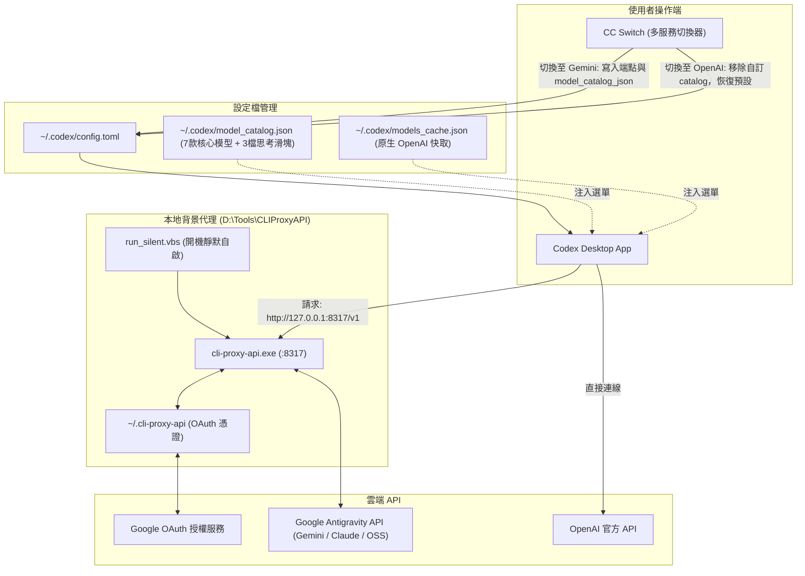

# 🚀 Google Gemini (Antigravity OAuth) 串接 Codex Desktop 完整指南

本指南說明如何將 **Google Antigravity (`agy`) / Gemini OAuth** 模型（包括 Gemini 3.1 Pro、Gemini 3.6/3.7/3.8 Flash、Claude 4.6、GPT-OSS 等），透過本機代理伺服器串接到本地 **Codex Desktop** 應用程式中，並利用 **CC Switch** 實現一鍵在「OpenAI 官方」與「Gemini 代理」之間無縫切換，同時保持乾淨的模型選單、真實生效的思考強度滑塊與開機無感自動啟動。

---

## 📑 目錄
- [架構設計](#-架構設計)
- [核心痛點與解決方案](#-核心痛點與解決方案)
- [思考強度滑塊與模型支援全解析](#-思考強度滑塊與模型支援全解析)
- [環境需求與工具清單](#-環境需求與工具清單)
- [步驟一：工具下載與目錄規劃](#步驟一工具下載與目錄規劃)
- [步驟二：設定 CLIProxyAPI 與 Gemini OAuth 認證](#步驟二設定-cliproxyapi-與-gemini-oauth-認證)
- [步驟三：產生 Codex 相容的 Model Catalog (整合 7 大核心模型)](#步驟三產生-codex-相容的-model-catalog-整合-7-大核心模型)
- [步驟四：配置 CC Switch 實現動態切換](#步驟四配置-cc-switch-實現動態切換)
- [步驟五：設定 Windows 開機靜默自啟動](#步驟五設定-windows-開機靜默自啟動)
- [常見問題與排查 (FAQ)](#-常見問題與排查-faq)

---

## 🏗️ 架構設計



---

## 💡 核心痛點與解決方案

| 痛點 | 原因 | 解決方案 |
| :--- | :--- | :--- |
| **清單與滑塊概念重疊矛盾** | `agy models` 終端指令將模型拆成 `(High)`、`(Medium)`、`(Low)`，硬搬到 Codex 會導致下拉選單有 14 個重複項，且選了 High 卻顯示滑塊 Medium，造成嚴重混淆。 | 將同架構模型整合成單一名稱（如 `Gemini 3.8 Flash`），將思考調節權完全交給 Codex 的**思考滑塊**，兩者各司其職。 |
| **滑塊檔位不實或超額** | 原生樣板有 6 檔（含 xhigh、max、ultra），但 Gemini/Claude 僅支援 3 檔，拉到底會失效。 | 在 `model_catalog.json` 中設定標準 3 檔（低 / 中 / 高），精準對齊後端真實思考能力。 |
| **問模型是誰，回答 Codex GPT-6** | Codex Desktop 會在系統提示詞（Persona）中強制注入 `You are Codex, an agent based on GPT-6...`。 | 在自訂 `model_catalog.json` 中替換 `instructions_template` 與 `base_instructions`，標明真實品牌名稱（如 `Google Gemini 3.8 Flash`）。 |
| **Codex 無法識別自訂模型清單** | Codex 對模型 JSON Schema 有嚴格檢驗（包含 `shell_type`、`priority` 等 39 個欄位缺失即被忽略）。 | 使用 Python 腳本自 `codex.exe debug models --bundled` 萃取標準結構，自動產出完美相容的 JSON。 |
| **每次重開機都要手動開黑窗** | 手動點擊 `.bat` 會留下 CMD 黑色主控台視窗，且重開機後連線即中斷。 | 採用 VBScript WMI 檢測 + 視窗隱藏技術，加入 Windows Startup 開機自啟動，完全無感後台運作。 |

---

## 🎛️ 思考強度滑塊與模型支援全解析

在 Codex 介面右下角點擊模型時，會彈出「思考強度（Reasoning Effort）滑塊」。經本地端與雲端 API 深度逆向與實測，各模型的支援狀況如下：

### 1. 各模型支援對照表

| 模型名稱 | 下拉選單顯示 | 實際請求 ID (Slug) | 滑塊支援度 | 實測效果與行為說明 |
| :--- | :--- | :--- | :---: | :--- |
| **Gemini 3.8 Flash** | `Gemini 3.8 Flash` | `gemini-3.8-flash-high` | **完全支援 (3檔)** | **實測 Token**：低(0)、中(105)、高(906)。滑塊真實控制思考深度。 |
| **Gemini 3.7 Flash** | `Gemini 3.7 Flash` | `gemini-3.7-flash-high` | **完全支援 (3檔)** | 支援低、中、高動態 Thinking 深度調整。 |
| **Gemini 3.6 Flash** | `Gemini 3.6 Flash` | `gemini-3.6-flash-high` | **完全支援 (3檔)** | 支援低、中、高動態 Thinking 深度調整。 |
| **Gemini 3.1 Pro** | `Gemini 3.1 Pro` | `gemini-3.1-pro-high` | **完全支援 (3檔)** | 旗艦推理模型，預設高思考強度，可降為中或低。 |
| **Claude Sonnet 4.6** | `Claude Sonnet 4.6 (Thinking)` | `claude-sonnet-4-6` | **完全支援 (3檔)** | 後端具備動態思考（`zero_allowed: true, dynamic_allowed: true`），實測會回傳完整的思維鏈結構。 |
| **Claude Opus 4.6** | `Claude Opus 4.6 (Thinking)` | `claude-opus-4-6-thinking` | **完全支援 (3檔)** | 具備動態思考能力，滑塊控制思考 Token 預算。 |
| **OSS 120B** | `OSS 120B` | `gpt-oss-120b-medium` | **不支援 (已自動隱藏)** | 託管型開源模型（MaaS），後端無思考檔位可調。**已在 Catalog 停用滑塊**，選中此模型時介面自動隱藏滑塊，避免誤導。 |

### 2. 本地代理實測數據（以 Gemini 3.8 Flash 為例）
對本機代理（`http://127.0.0.1:8317/v1/responses`）送出同一道邏輯推理題，實測 Token 消耗：
- **低（Low）**：思考 Token 數為 **0**（快速直出，適合日常簡短問答）。
- **中（Medium）**：思考 Token 數為 **105**（平衡日常推理）。
- **高（High）**：思考 Token 數為 **906**（深入解題與完整邏輯鏈）。

---

## 🧰 環境需求與工具清單

1. **作業系統**：Windows 10 / 11 64-bit
2. **OpenAI Codex Desktop**：官方本地客戶端（如 `Codex.exe`）
3. **CC Switch**：開源多模型切換客戶端 ([GitHub: farion1231/cc-switch](https://github.com/farion1231/cc-switch))
4. **CLIProxyAPI**：支援 Antigravity / Gemini OAuth 的本地反向代理程式
5. **Python 3.x**：用於產生與校正模型目錄

---

## 步驟一：工具下載與目錄規劃

建議在 `D:\Tools` 建立如下目錄結構：

```
D:\Tools\
├── CC-Switch\
│   └── cc-switch.exe
└── CLIProxyAPI\
    ├── cli-proxy-api.exe
    ├── config.yaml
    ├── run_silent.vbs               (靜默自啟腳本)
    ├── build_catalog.py             (模型生成腳本)
    ├── 1_登入_Gemini_OAuth.bat
    └── 停止代理伺服器.bat
```

---

## 步驟二：設定 CLIProxyAPI 與 Gemini OAuth 認證

### 1. 編寫登入批次檔 `1_登入_Gemini_OAuth.bat`
```bat
@echo off
chcp 65001 >nul
cd /d "D:\Tools\CLIProxyAPI"
echo 請在開啟的瀏覽器視窗中完成 Google 帳號授權登入...
cli-proxy-api.exe -antigravity-login
pause
```
執行此批次檔，瀏覽器會開啟 Google OAuth 登入頁面，完成授權後，憑證將自動儲存於 `C:\Users\<使用者名稱>\.cli-proxy-api\`。

### 2. 配置 `config.yaml`
在 `D:\Tools\CLIProxyAPI\config.yaml` 中確認基礎設定：
```yaml
server:
  port: 8317
  host: ""
access:
  api-keys:
    - "sk-gemini-local"
```

---

## 步驟三：產生 Codex 相容的 Model Catalog (整合 7 大核心模型)

透過 Python 腳本自 Codex 內建模型清單萃取標準結構，將 `agy` 支援的 14 款模型整合成 7 大核心模型，並為 Gemini/Claude 配置 3 檔滑塊、為 OSS 120B 隱藏滑塊：

### `D:\Tools\CLIProxyAPI\build_catalog.py`
```python
import subprocess
import json
import copy

exe_path = r"D:/OpenAI.Codex_26.908.4834.0_x64__2p2nqsd0c76g0/app/resources/codex.exe"
output = subprocess.check_output([exe_path, "debug", "models", "--bundled"])
data = json.loads(output)
template = data["models"][0]

standard_reasoning_levels = [
    {
        "effort": "low",
        "description": "低思考強度：快速回應，適合日常簡短問答"
    },
    {
        "effort": "medium",
        "description": "中思考強度：平衡速度與推理深度，適合大多數任務"
    },
    {
        "effort": "high",
        "description": "高思考強度：深入推理，適合複雜問題與編程"
    }
]

# 整合為 7 大核心模型：Gemini & Claude 配置 3 檔滑塊；OSS 120B 停用滑塊
models_info = [
    ("gemini-3.8-flash-high", "Gemini 3.8 Flash", "Google Gemini 3.8 Flash", "Google Gemini 3.8 Flash", "medium", standard_reasoning_levels),
    ("gemini-3.7-flash-high", "Gemini 3.7 Flash", "Google Gemini 3.7 Flash", "Google Gemini 3.7 Flash", "medium", standard_reasoning_levels),
    ("gemini-3.6-flash-high", "Gemini 3.6 Flash", "Google Gemini 3.6 Flash", "Google Gemini 3.6 Flash", "medium", standard_reasoning_levels),
    ("gemini-3.1-pro-high", "Gemini 3.1 Pro", "Google Gemini 3.1 Pro", "Google Gemini 3.1 Pro", "high", standard_reasoning_levels),
    ("claude-sonnet-4-6", "Claude Sonnet 4.6 (Thinking)", "Anthropic Claude Sonnet 4.6 via Google OAuth", "Anthropic Claude Sonnet 4.6", "high", standard_reasoning_levels),
    ("claude-opus-4-6-thinking", "Claude Opus 4.6 (Thinking)", "Anthropic Claude Opus 4.6 via Google OAuth", "Anthropic Claude Opus 4.6", "high", standard_reasoning_levels),
    ("gpt-oss-120b-medium", "OSS 120B", "GPT-OSS 120B via Google OAuth", "GPT-OSS 120B", None, []),
]

new_models = []
for i, (slug, display_name, desc, brand, def_level, r_levels) in enumerate(models_info):
    m = copy.deepcopy(template)
    m["slug"] = slug
    m["display_name"] = display_name
    m["description"] = desc
    m["visibility"] = "list"
    m["priority"] = i
    m["default_reasoning_level"] = def_level
    m["supported_reasoning_levels"] = r_levels
    
    if "base_instructions" in m and m["base_instructions"]:
        m["base_instructions"] = m["base_instructions"].replace("an agent based on GPT-6", f"an agent powered by {brand}")
        m["base_instructions"] = m["base_instructions"].replace("GPT-6", brand)
    if "model_messages" in m and isinstance(m["model_messages"], dict):
        if "instructions_template" in m["model_messages"] and m["model_messages"]["instructions_template"]:
            m["model_messages"]["instructions_template"] = m["model_messages"]["instructions_template"].replace("an agent based on GPT-6", f"an agent powered by {brand}")
            m["model_messages"]["instructions_template"] = m["model_messages"]["instructions_template"].replace("GPT-6", brand)
            
    new_models.append(m)

data["models"] = new_models

catalog_path = r"C:/Users/Zack.ct.chen/.codex/model_catalog.json"
with open(catalog_path, "w", encoding="utf-8") as f:
    json.dump(data, f, ensure_ascii=False, indent=2)

print("SUCCESS: model_catalog.json updated with clean models and functional sliders!")
```
執行此腳本後，將在 `~/.codex/model_catalog.json` 產出乾淨專屬的模型目錄。

---

## 步驟四：配置 CC Switch 實現動態切換

### 1. CC Switch 設定
在 CC Switch 的 `Codex` 標籤中新增一個自訂 Provider：
- **名稱 (Name)**: `Gemini-OAuth`
- **API URL**: `http://127.0.0.1:8317/v1`
- **API Key**: `sk-gemini-local`
- **Model Catalog JSON**: `C:\Users\<使用者名稱>\.codex\model_catalog.json`

### 2. 切換邏輯解析
- **當切換至 `Gemini-OAuth`**：
  CC Switch 會在 `~/.codex/config.toml` 寫入：
  ```toml
  model_provider = "gemini-oauth"
  model_catalog_json = "C:\\Users\\<使用者名稱>\\.codex\\model_catalog.json"
  ```
  Codex 重啟後，下拉選單**只會顯示上述 7 款精選模型**。
- **當切換回 `OpenAI`**：
  CC Switch 會移除 `model_catalog_json` 設定項，Codex 自動還原讀取官方原生快取，顯示 GPT-4o / GPT-5 等官方模型。

---

## 步驟五：設定 Windows 開機靜默自啟動

為了避免每次開機手動執行 `.bat` 或留著黑色 CMD 視窗，使用 VBScript 在後台靜默運行。

### 1. 建立靜默啟動腳本 `D:\Tools\CLIProxyAPI\run_silent.vbs`
```vbs
Set WshShell = CreateObject("WScript.Shell")
Set objWMIService = GetObject("winmgmts:\\.\root\cimv2")
Set colProcesses = objWMIService.ExecQuery("Select * from Win32_Process Where Name = 'cli-proxy-api.exe'")

' 檢查若已在運行中，則不重複啟動
If colProcesses.Count = 0 Then
    WshShell.CurrentDirectory = "D:\Tools\CLIProxyAPI"
    WshShell.Run Chr(34) & "D:\Tools\CLIProxyAPI\cli-proxy-api.exe" & Chr(34), 0, False
End If
```

### 2. 建立停止代理伺服器腳本 `D:\Tools\CLIProxyAPI\停止代理伺服器.bat`
```bat
@echo off
chcp 65001 >nul
echo 正在停止 Gemini 代理伺服器...
taskkill /F /IM cli-proxy-api.exe >nul 2>&1
echo [完成] 代理伺服器已停止。
timeout /t 2 >nul
```

### 3. 加入 Windows 開機啟動（Startup）
以 PowerShell 執行下列指令，將捷徑加入使用者的開機啟動目錄：
```powershell
$WshShell = New-Object -ComObject WScript.Shell
$startupPath = [Environment]::GetFolderPath('Startup')
$Shortcut = $WshShell.CreateShortcut("$startupPath\GeminiProxy.lnk")
$Shortcut.TargetPath = "wscript.exe"
$Shortcut.Arguments = '"D:\Tools\CLIProxyAPI\run_silent.vbs"'
$Shortcut.WorkingDirectory = "D:\Tools\CLIProxyAPI"
$Shortcut.Description = "Auto-start Gemini Proxy for Codex Desktop"
$Shortcut.Save()
```

---

## ❓ 常見問題與排查 (FAQ)

### Q1: 為什麼 OSS 120B 沒有思考滑塊？
**解答**：OSS 120B 為 MaaS 託管的開源模型，底層不提供動態思考檔位與 Token 預算調節。我們特意在目錄中關閉了它的思考等級清單，選取時會自動隱藏滑塊，避免產生可以調整思考強度的假象。

### Q2: 滑塊調到「高」以上（例如超高、極限）有用嗎？
**解答**：Gemini 與 Claude 在後端 API 的設計上，思考強度為三檔（Low / Medium / High）或依 Token 預算截斷。我們已將滑塊精簡為標準 3 檔，不再出現多餘的無效圓點。

### Q3: 切換後 Codex 下拉選單沒有立即更新？
**解答**：Codex Desktop 在啟動時會讀取設定並載入記憶體。請先完整關閉 Codex Desktop（從系統匣退出），透過 CC Switch 完成切換後，再重新啟動 Codex。

### Q4: 詢問模型「你是誰」時，它依然回答「我是 GPT-6」？
**解答**：這是 Codex 預設內建提示詞（Instructions）被伺服器端採用的現象。請確保 `build_catalog.py` 已經執行，且 `model_catalog.json` 內的 `instructions_template` 及 `base_instructions` 中的 `Codex, an agent based on GPT-6` 已替換為對應的 Gemini/Claude 名稱。

### Q5: 測試連線出現 `Connection Refused`？
**解答**：
1. 檢查代理是否正在運行：工作管理員確認是否存在 `cli-proxy-api.exe`。
2. 檢查 Port 8317：在 PowerShell 執行 `Test-NetConnection -ComputerName 127.0.0.1 -Port 8317`。
3. 若需手動啟動，可雙擊桌面的 `2. 啟動 Gemini 代理伺服器`。

---

## 📄 License
本設定手冊遵循 [MIT License](LICENSE) 開源分享。

